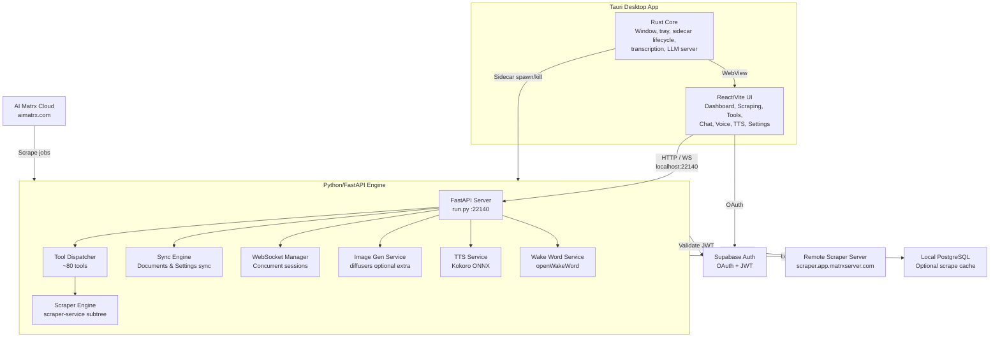
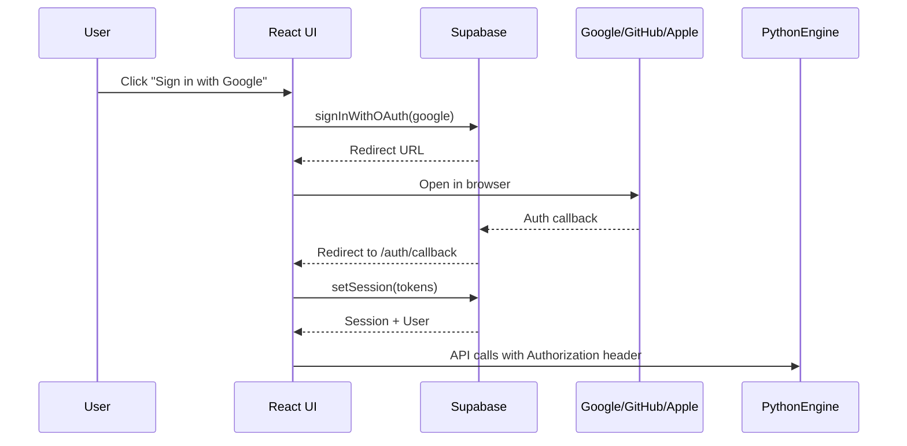

# Matrx Local — System Architecture

> Deep-dive technical reference. Start with **CLAUDE.md** for rules and conventions.

---

## What is Matrx Local?

Matrx Local is the companion desktop application for **AI Matrx**. It runs on the user's machine and exposes a tool-based API (REST + WebSocket) that AI Matrx web/mobile apps and AI agents call to interact with the local environment: filesystem, shell, browser, clipboard, hardware, and residential IP. It integrates a production-grade scraping engine for bypassing anti-bot protections using the user's real browser and real IP. It also runs local AI models (text via llama-server sidecar, image generation via optional diffusers, TTS via Kokoro ONNX) directly on the user's hardware.

---

## High-Level Architecture


```mermaid
graph TB
  subgraph TauriApp [Tauri Desktop App]
    RustCore["Rust Core<br/>Window, tray, sidecar lifecycle,<br/>transcription, LLM server"]
    ReactUI["React/Vite UI<br/>Dashboard, Scraping, Tools,<br/>Chat, Voice, TTS, Settings"]
    RustCore -->|WebView| ReactUI
  end

  subgraph PythonEngine [Python/FastAPI Engine]
    FastAPI["FastAPI Server<br/>run.py :22140"]
    ToolDispatcher["Tool Dispatcher<br/>~80 tools"]
    ScraperEngine["Scraper Engine<br/>scraper-service subtree"]
    SyncEngine["Sync Engine<br/>Documents & Settings sync"]
    WSManager["WebSocket Manager<br/>Concurrent sessions"]
    ImageGenSvc["Image Gen Service<br/>diffusers optional extra"]
    TTSSvc["TTS Service<br/>Kokoro ONNX"]
    WakeWordSvc["Wake Word Service<br/>openWakeWord"]
    FastAPI --> ToolDispatcher
    FastAPI --> WSManager
    FastAPI --> SyncEngine
    FastAPI --> ImageGenSvc
    FastAPI --> TTSSvc
    FastAPI --> WakeWordSvc
    ToolDispatcher --> ScraperEngine
  end

  ReactUI -->|"HTTP / WS<br/>localhost:22140"| FastAPI
  RustCore -->|"Sidecar spawn/kill"| PythonEngine

  Cloud["AI Matrx Cloud<br/>aimatrx.com"]
  SupabaseAuth["Supabase Auth<br/>OAuth + JWT"]
  RemoteScraper["Remote Scraper Server<br/>scraper.app.matrxserver.com"]
  LocalDB["Local PostgreSQL<br/>Optional scrape cache"]

  ReactUI -->|OAuth| SupabaseAuth
  PythonEngine -->|"Validate JWT"| SupabaseAuth
  PythonEngine -->|"Local cache"| LocalDB
  PythonEngine -->|"Bearer token"| RemoteScraper
  Cloud -->|"Scrape jobs"| PythonEngine
```

### Data Flow

1. **User interacts** with the React UI in the Tauri WebView.
2. **React sends** REST or WebSocket requests to the Python engine at `localhost:22140`.
3. **Python dispatches** the request to the appropriate tool handler.
4. **Tool executes** the operation (file I/O, shell command, scrape, etc.).
5. **Result returns** through the same transport to the UI.

In production, Tauri spawns the Python engine as a managed child process (sidecar). In development, the Python engine runs standalone.

---

## Project Structure

```
matrx_local/
├── app/                            # Python engine source
│   ├── main.py                     # FastAPI app, CORS, scraper lifespan
│   ├── config.py                   # Env-based configuration (Pydantic Settings)
│   ├── websocket_manager.py        # WS connection handling
│   ├── api/
│   │   ├── routes.py               # Health, version, logs
│   │   ├── tool_routes.py          # /tools/invoke, /tools/list
│   │   ├── auth.py                 # Engine auth middleware
│   │   ├── remote_scraper_routes.py # /remote-scraper/* proxy
│   │   ├── image_gen_routes.py     # /image-gen/* (optional diffusers)
│   │   ├── tts_routes.py           # /tts/* (Kokoro TTS)
│   │   ├── wake_word_routes.py     # /wake-word/* (openWakeWord)
│   │   ├── document_routes.py      # /notes/* (local-first documents)
│   │   ├── settings_routes.py      # /settings/*
│   │   ├── proxy_routes.py         # /proxy/* (local HTTP proxy)
│   │   └── cloud_sync_routes.py    # /cloud-sync/* (instance + settings)
│   ├── tools/
│   │   ├── dispatcher.py           # Tool routing (~80 tools registered)
│   │   ├── session.py              # Per-connection state (cwd, bg processes)
│   │   ├── types.py                # ToolResult, ToolResultType
│   │   └── tools/                  # Individual tool implementations (~33 files)
│   │       ├── file_ops.py         # Read, Write, Edit, Glob, Grep
│   │       ├── execution.py        # Bash, BashOutput, TaskStop
│   │       ├── system.py           # SystemInfo, Screenshot, etc.
│   │       ├── network.py          # FetchUrl, FetchWithBrowser, Scrape, Search, Research
│   │       ├── browser_automation.py # BrowserNavigate, Click, Type, Extract, etc.
│   │       ├── audio.py            # ListAudioDevices, RecordAudio, PlayAudio, Transcribe
│   │       ├── documents.py        # Document CRUD tools
│   │       └── ...                 # clipboard, notify, transfer, process_manager,
│   │                               # window_manager, input_automation, network_discovery,
│   │                               # system_monitor, file_watch, app_integration,
│   │                               # scheduler, media, wifi_bluetooth
│   ├── services/
│   │   ├── scraper/
│   │   │   ├── engine.py           # ScraperEngine bridge (sys.modules alias)
│   │   │   └── remote_client.py    # HTTP client for remote scraper server
│   │   ├── image_gen/
│   │   │   ├── models.py           # Model catalog + workflow presets
│   │   │   └── service.py          # ImageGenService singleton (lazy diffusers)
│   │   ├── tts/
│   │   │   ├── models.py           # 54 voices × 9 languages catalog
│   │   │   └── service.py          # Kokoro ONNX singleton (~300 MB model)
│   │   ├── wake_word/
│   │   │   ├── models.py           # Wake word models
│   │   │   └── service.py          # openWakeWord service
│   │   ├── documents/
│   │   │   ├── file_manager.py     # Local filesystem operations
│   │   │   ├── supabase_client.py  # Supabase sync client
│   │   │   └── sync_engine.py      # Local-first sync engine
│   │   ├── cloud_sync/
│   │   │   ├── instance_manager.py # App instance registration
│   │   │   └── settings_sync.py    # Settings sync engine
│   │   └── proxy/
│   │       └── server.py           # Local HTTP proxy (127.0.0.1:22180)
│   └── common/
│       └── system_logger.py        # Rotating file + console logging
├── scraper-service/                # Git subtree — READ-ONLY (see CLAUDE.md rule 1)
├── desktop/                        # Tauri + React desktop UI
│   ├── src/
│   │   ├── App.tsx                 # Router, auth guard, context providers
│   │   ├── index.css               # Dark theme (shadcn/ui CSS vars)
│   │   ├── components/
│   │   │   ├── layout/             # Sidebar, Header, AppLayout
│   │   │   ├── documents/          # NoteEditor, FolderTree, SyncStatus, etc.
│   │   │   ├── llm/                # ModelRepoAnalyzer, LLM-specific components
│   │   │   └── ui/                 # shadcn/ui primitives (Button, Card, Badge, etc.)
│   │   ├── contexts/               # Singleton state providers (see CLAUDE.md)
│   │   │   ├── LlmContext.tsx
│   │   │   ├── TtsContext.tsx
│   │   │   ├── TranscriptionContext.tsx
│   │   │   ├── WakeWordContext.tsx
│   │   │   ├── TranscriptionSessionsContext.tsx
│   │   │   ├── PermissionsContext.tsx
│   │   │   ├── AudioDevicesContext.tsx
│   │   │   └── DownloadManagerContext.tsx
│   │   ├── pages/                  # ~23 page components
│   │   │   ├── Dashboard.tsx       # Engine status, system info
│   │   │   ├── Scraping.tsx        # URL input, batch scrape, dual-mode
│   │   │   ├── Tools.tsx           # Browse and invoke all tools
│   │   │   ├── Activity.tsx        # Real-time WebSocket event log
│   │   │   ├── Chat.tsx            # AI chat (cloud agents or local LLM)
│   │   │   ├── LocalModels.tsx     # LLM model picker, inference, server
│   │   │   ├── Wake.tsx            # Whisper transcription + wake word
│   │   │   ├── TextToSpeech.tsx    # Kokoro TTS UI
│   │   │   ├── Documents.tsx       # Local-first notes with Supabase sync
│   │   │   ├── Settings.tsx        # Engine, scraping, theme, account
│   │   │   ├── Configurations.tsx  # Detailed app configuration
│   │   │   ├── Login.tsx           # OAuth (Google/GitHub/Apple) + email
│   │   │   ├── AuthCallback.tsx    # OAuth redirect handler
│   │   │   └── ...                 # AiMatrx, BrowserLab, Devices, Ports,
│   │   │                           # SystemPrompts, Tunneling, etc.
│   │   ├── hooks/                  # ~26 custom hooks
│   │   │   ├── use-engine.ts       # Engine auto-discovery, health, WS
│   │   │   ├── use-auth.ts         # Supabase auth state + OAuth
│   │   │   ├── use-llm.ts          # Local LLM server state + actions
│   │   │   ├── use-tts.ts          # TTS state + actions
│   │   │   ├── use-chat-tts.ts     # Chat read-aloud bridge
│   │   │   ├── use-transcription.ts # Whisper transcription
│   │   │   ├── use-documents.ts    # Document CRUD + sync
│   │   │   ├── use-auto-update.ts  # Background app update pre-download
│   │   │   ├── use-theme.ts        # Dark/light/system theme
│   │   │   └── ...                 # use-chat, use-scrape, use-wake-word,
│   │   │                           # use-permissions, use-configurations, etc.
│   │   └── lib/
│   │       ├── api.ts              # REST + WS client for Python engine
│   │       ├── supabase.ts         # Supabase client singleton
│   │       ├── sidecar.ts          # Tauri sidecar lifecycle + port discovery
│   │       ├── settings.ts         # App settings persistence (localStorage)
│   │       ├── platformCtx.ts      # Platform context init
│   │       ├── image-gen/          # Image gen API client + types
│   │       ├── llm/                # llama-server streaming client + types
│   │       ├── tts/                # TTS API client + types
│   │       ├── transcription/      # Transcription types + session persistence
│   │       └── utils.ts            # cn(), formatBytes, formatDuration
│   ├── src-tauri/                  # Rust backend
│   │   ├── src/
│   │   │   ├── lib.rs              # Sidecar spawn/kill, system tray, hide-to-tray
│   │   │   ├── main.rs             # Windows subsystem entry point
│   │   │   ├── transcription/      # Whisper: audio_capture, hardware, model_selector, etc.
│   │   │   └── llm/                # llama-server: config, model_selector, server mgmt
│   │   ├── tauri.conf.json         # App config, CSP, sidecar + bundle settings
│   │   ├── capabilities/           # Permission grants (shell, notification, store)
│   │   └── Cargo.toml              # tauri v2, shell/notification/store plugins
│   ├── package.json
│   ├── vite.config.ts
│   └── tailwind.config.ts
├── scripts/
│   ├── build-sidecar.sh            # PyInstaller → platform-named binary
│   ├── update-scraper.sh           # Pull upstream scraper-service changes
│   ├── download-llama-server.sh    # Download llama-server binaries
│   ├── download-cloudflared.sh     # Download cloudflared sidecar binary
│   ├── release.sh                  # Version bump + tag + push
│   ├── launch.sh                   # Full dev launch (engine + frontend)
│   └── ...                         # setup.sh, generate-icons.sh, check.sh, etc.
├── specs/                          # PyInstaller specs (4 platforms)
│   ├── aimatrx-engine-aarch64-apple-darwin.spec
│   ├── aimatrx-engine-x86_64-apple-darwin.spec
│   ├── aimatrx-engine-x86_64-unknown-linux-gnu.spec
│   └── aimatrx-engine-x86_64-pc-windows-msvc.spec
├── migrations/                     # Supabase SQL migrations (001–008)
├── docs/                           # Feature-specific guides
├── run.py                          # Entry point (port discovery, tray, uvicorn)
├── pyproject.toml                  # Python deps (uv-managed)
└── .env                            # Local config (not committed)
```

---

## Technology Stack

| Layer | Technology | Version |
|-------|-----------|---------|
| **Desktop Shell** | Tauri v2 (Rust) | 2.x |
| **Frontend** | React + TypeScript + Vite | React 19, TS 5.7, Vite 6 |
| **Styling** | Tailwind CSS + shadcn/ui | TW 3.4 |
| **Python Runtime** | Python | 3.13+ |
| **API Framework** | FastAPI + Uvicorn | Latest |
| **Auth** | Supabase Auth | OAuth (Google, GitHub, Apple) + email |
| **Database** | PostgreSQL (optional local cache) | asyncpg |
| **Remote Scraper** | REST API at scraper.app.matrxserver.com | httpx |
| **Scraping** | httpx, curl-cffi, Playwright, BeautifulSoup, PyMuPDF | See pyproject.toml |
| **Search** | Brave Search API | Optional |
| **Local LLM** | llama-server (llama.cpp) sidecar | Bundled binary |
| **Image Gen** | Hugging Face Diffusers (optional `[image-gen]` extra) | torch + diffusers |
| **TTS** | Kokoro ONNX (core, always installed) | kokoro-onnx |
| **Wake Word** | openWakeWord (ONNX Runtime) | Core dep |
| **Package Manager (JS)** | pnpm | 10.x |
| **Package Manager (Python)** | uv | Latest |

---

## Communication Protocols

### REST API

| Endpoint | Method | Description |
|----------|--------|-------------|
| `/tools/list` | GET | List all available tools |
| `/tools/invoke` | POST | Invoke a tool (stateless session) |
| `/image-gen/status` | GET | Image gen availability + loaded model |
| `/image-gen/models` | GET | Model catalog (FLUX, HunyuanDiT, SDXL, etc.) |
| `/image-gen/presets` | GET | Workflow presets (portrait, product, landscape, etc.) |
| `/image-gen/load` | POST | Load a model into memory (downloads from HF) |
| `/image-gen/unload` | POST | Unload model, free VRAM |
| `/image-gen/generate` | POST | Text-to-image → base64 PNG |
| `/image-gen/generate-workflow` | POST | Fill preset template + generate |
| `/tts/status` | GET | TTS availability + loaded model |
| `/tts/voices` | GET | Voice catalog (54 voices × 9 languages) |
| `/tts/synthesize` | POST | Text-to-speech → WAV |
| `/tts/synthesize-stream` | POST | Streaming TTS (sentence-boundary chunks) |
| `/wake-word/status` | GET | Wake word detection status |
| `/notes/*` | CRUD | Local-first document management |
| `/settings/*` | GET/PUT | Engine settings |
| `/cloud-sync/*` | Various | Instance registration + settings sync |
| `/proxy/*` | Various | Local HTTP proxy status + test |

**POST /tools/invoke** body:
```json
{
  "tool": "Scrape",
  "input": { "urls": ["https://example.com"], "use_cache": true }
}
```

**Response:**
```json
{
  "type": "success",
  "output": "Human-readable text output",
  "image": null,
  "metadata": { "status_code": 200, "content_type": "html" }
}
```

REST creates a fresh session per request. State does not persist between calls.

### WebSocket (`/ws`)

Persistent sessions with concurrent tool execution and cancellation.

```json
// Send a tool call
{ "id": "req-1", "tool": "Scrape", "input": { "urls": ["https://example.com"] } }

// Receive result
{ "id": "req-1", "type": "success", "output": "...", "metadata": { ... } }

// Cancel a task
{ "id": "req-1", "action": "cancel" }

// Cancel all running tasks
{ "action": "cancel_all" }
```

Multiple tool calls run simultaneously on one connection. Each uses its own `id`.

### Remote Scraper Proxy (`/remote-scraper/*`)

The React frontend calls the Python engine's `/remote-scraper/*` routes, which proxy requests to the remote scraper server. This keeps auth tokens server-side — the frontend never talks to the remote server directly.

| Endpoint | Method | Proxies To | Description |
|----------|--------|-----------|-------------|
| `/remote-scraper/status` | GET | `GET /api/v1/health` | Check remote server availability |
| `/remote-scraper/scrape` | POST | `POST /api/v1/scrape` | Scrape URLs via remote server |
| `/remote-scraper/search` | POST | `POST /api/v1/search` | Search via remote server |
| `/remote-scraper/search-and-scrape` | POST | `POST /api/v1/search-and-scrape` | Combined search + scrape |
| `/remote-scraper/research` | POST | `POST /api/v1/research` | Deep research via remote server |

Auth: The Python engine attaches `Authorization: Bearer <SCRAPER_API_KEY>` from the env var. In production, this is replaced with the user's Supabase JWT.

---

## Tool Reference (~80 Tools)

### File Operations (5)

| Tool | Parameters | Description |
|------|-----------|-------------|
| `Read` | `path` | Read file contents |
| `Write` | `path`, `content` | Write/overwrite a file |
| `Edit` | `path`, `old_text`, `new_text` | Find-and-replace in a file |
| `Glob` | `pattern`, `path?` | Find files matching a glob pattern |
| `Grep` | `pattern`, `path?`, `include?` | Search file contents with regex |

### Shell Execution (3)

| Tool | Parameters | Description |
|------|-----------|-------------|
| `Bash` | `command`, `timeout?` | Execute shell command (fg or bg) |
| `BashOutput` | `shell_id` | Read background shell output |
| `TaskStop` | `shell_id` | Kill a background process |

### System (5)

| Tool | Parameters | Description |
|------|-----------|-------------|
| `SystemInfo` | *(none)* | OS, CPU, memory, disk, Python version |
| `Screenshot` | *(none)* | Capture screen (base64 PNG) |
| `ListDirectory` | `path?` | List directory contents |
| `OpenUrl` | `url` | Open URL in default browser |
| `OpenPath` | `path` | Open file/folder in default app |

### Clipboard (2)

| Tool | Parameters | Description |
|------|-----------|-------------|
| `ClipboardRead` | *(none)* | Read clipboard text |
| `ClipboardWrite` | `text` | Write text to clipboard |

### Notifications (1)

| Tool | Parameters | Description |
|------|-----------|-------------|
| `Notify` | `title`, `message` | Native OS notification |

### Network — Simple (2)

| Tool | Parameters | Description |
|------|-----------|-------------|
| `FetchUrl` | `url`, `method?`, `headers?`, `body?`, `follow_redirects?`, `timeout?` | Direct HTTP from residential IP |
| `FetchWithBrowser` | `url`, `wait_for?`, `wait_timeout?`, `extract_text?` | Playwright headless fetch |

### Network — Scraper Engine (3)

| Tool | Parameters | Description |
|------|-----------|-------------|
| `Scrape` | `urls[]`, `use_cache?`, `output_mode?`, `get_links?`, `get_overview?` | Full multi-strategy scraper |
| `Search` | `keywords[]`, `country?`, `count?`, `freshness?` | Brave Search API |
| `Research` | `query`, `country?`, `effort?`, `freshness?` | Deep research (search + scrape + compile) |

### File Transfer (2)

| Tool | Parameters | Description |
|------|-----------|-------------|
| `DownloadFile` | `url`, `path` | Download file to local path |
| `UploadFile` | `path`, `url` | Upload local file to URL |

### Process Management (4)

| Tool | Parameters | Description |
|------|-----------|-------------|
| `ListProcesses` | `filter?`, `sort_by?`, `limit?` | List running processes with CPU/memory |
| `LaunchApp` | `application`, `args?`, `wait?` | Launch an application by name or path |
| `KillProcess` | `pid?`, `name?`, `force?` | Kill a process by PID or name |
| `FocusApp` | `application` | Bring an app window to the foreground |

### Window Management (4)

| Tool | Parameters | Description |
|------|-----------|-------------|
| `ListWindows` | `app_filter?` | List all visible windows with positions/sizes |
| `FocusWindow` | `app_name`, `window_title?` | Focus/activate a specific window |
| `MoveWindow` | `app_name`, `x?`, `y?`, `width?`, `height?` | Move and/or resize a window |
| `MinimizeWindow` | `app_name`, `action` | Minimize, maximize, or restore a window |

### Input Automation (4)

| Tool | Parameters | Description |
|------|-----------|-------------|
| `TypeText` | `text`, `delay_ms?`, `app_name?` | Type text via simulated keystrokes |
| `Hotkey` | `keys`, `app_name?` | Send keyboard shortcut (e.g., cmd+c) |
| `MouseClick` | `x`, `y`, `button?`, `clicks?` | Click mouse at screen coordinates |
| `MouseMove` | `x`, `y` | Move mouse cursor to coordinates |

### Audio (4)

| Tool | Parameters | Description |
|------|-----------|-------------|
| `ListAudioDevices` | *(none)* | List microphones and speakers |
| `RecordAudio` | `duration_seconds?`, `device_index?` | Record audio from microphone |
| `PlayAudio` | `file_path`, `device_index?` | Play an audio file |
| `TranscribeAudio` | `file_path`, `model?`, `language?` | Transcribe audio to text (Whisper) |

### Browser Automation (7)

| Tool | Parameters | Description |
|------|-----------|-------------|
| `BrowserNavigate` | `url`, `wait_for?` | Navigate to URL in controlled browser |
| `BrowserClick` | `selector` | Click element by CSS selector |
| `BrowserType` | `selector`, `text`, `press_enter?` | Type into input element |
| `BrowserExtract` | `selector?`, `extract_type` | Extract text, HTML, links, or tables |
| `BrowserScreenshot` | `full_page?`, `selector?` | Screenshot page or element |
| `BrowserEval` | `javascript` | Execute JavaScript on current page |
| `BrowserTabs` | `action`, `tab_index?`, `url?` | Manage browser tabs (list/new/close/switch) |

### Network Discovery (4)

| Tool | Parameters | Description |
|------|-----------|-------------|
| `NetworkInfo` | *(none)* | Get network interfaces, IPs, gateway, DNS |
| `NetworkScan` | `subnet?`, `timeout?` | Scan local network for devices (ARP) |
| `PortScan` | `host`, `ports?` | Scan ports on a host |
| `MDNSDiscover` | `service_type?` | Discover mDNS/Bonjour services |

### System Monitoring (4)

| Tool | Parameters | Description |
|------|-----------|-------------|
| `SystemResources` | *(none)* | CPU, RAM, disk, network I/O, uptime |
| `BatteryStatus` | *(none)* | Battery level and charging status |
| `DiskUsage` | `path?` | Disk usage for all volumes or specific path |
| `TopProcesses` | `sort_by?`, `limit?` | Top N processes by CPU or memory |

### File Watching (3)

| Tool | Parameters | Description |
|------|-----------|-------------|
| `WatchDirectory` | `path`, `recursive?`, `patterns?` | Start watching directory for changes |
| `WatchEvents` | `watch_id`, `since_seconds?` | Get accumulated file change events |
| `StopWatch` | `watch_id` | Stop watching a directory |

### OS App Integration (3)

| Tool | Parameters | Description |
|------|-----------|-------------|
| `AppleScript` | `script` | Run AppleScript (macOS only) |
| `PowerShellScript` | `script` | Run PowerShell script (Windows only) |
| `GetInstalledApps` | `filter?` | List installed applications |

### Scheduler / Heartbeat (5)

| Tool | Parameters | Description |
|------|-----------|-------------|
| `ScheduleTask` | `name`, `tool_name`, `tool_input`, `interval_seconds` | Schedule recurring tool execution |
| `ListScheduled` | *(none)* | List all scheduled tasks |
| `CancelScheduled` | `task_id` | Cancel a scheduled task |
| `HeartbeatStatus` | *(none)* | Get scheduler system status |
| `PreventSleep` | `enable`, `reason?`, `duration_minutes?` | Prevent system from sleeping |

### Media Processing (5)

| Tool | Parameters | Description |
|------|-----------|-------------|
| `ImageOCR` | `file_path`, `language?` | Extract text from image (Tesseract) |
| `ImageResize` | `file_path`, `width?`, `height?`, `scale?` | Resize/convert images |
| `PdfExtract` | `file_path`, `pages?`, `extract_images?` | Extract text from PDF |
| `ArchiveCreate` | `source_paths`, `format?` | Create zip/tar archive |
| `ArchiveExtract` | `file_path`, `output_dir?` | Extract archive |

### WiFi & Bluetooth (3)

| Tool | Parameters | Description |
|------|-----------|-------------|
| `WifiNetworks` | `rescan?` | List available WiFi networks |
| `BluetoothDevices` | `scan_duration?` | List paired and nearby Bluetooth devices |
| `ConnectedDevices` | *(none)* | List connected USB/Bluetooth peripherals |

---

## Scraper Engine

The scraper engine is sourced from the `aidream` monorepo via **git subtree** (see CLAUDE.md rule 1).

### Import Isolation

Both `matrx_local` and `scraper-service` have an `app/` package. `ScraperEngine` in `app/services/scraper/engine.py` aliases the scraper's `app` as `scraper_app` via `sys.modules`, allowing zero modifications to upstream code.

### Multi-Strategy Fetching

1. **httpx** — Fast, lightweight HTTP client
2. **curl-cffi** — Browser TLS impersonation (bypasses JA3 fingerprinting)
3. **Playwright** — Full headless browser (Cloudflare Turnstile, JS-heavy sites)

The engine tries strategies in order, escalating only when the simpler approach fails.

### Graceful Degradation

| Resource | Available | Degraded |
|----------|-----------|----------|
| PostgreSQL (`DATABASE_URL`) | Persistent page cache | In-memory TTLCache only |
| Playwright | Full browser fallback | httpx + curl-cffi only |
| Brave API key | Search + Research tools | Search disabled, Scrape works |
| Proxies | Proxy rotation on blocks | Direct requests only |

### Updating the Scraper

```bash
./scripts/update-scraper.sh --local   # From local aidream repo
./scripts/update-scraper.sh           # From GitHub
uv sync                                # If scraper deps changed
```

---

## Remote Scraper Server

The desktop app can delegate scraping to `scraper.app.matrxserver.com` via the engine's `/remote-scraper/*` proxy routes.

### Authentication

Dual auth:
1. **API Key** — `Authorization: Bearer <API_KEY>` (server-to-server)
2. **Supabase JWT** — `Authorization: Bearer <jwt>` (end users, validated via JWKS)

JWKS endpoint: `https://txzxabzwovsujtloxrus.supabase.co/auth/v1/.well-known/jwks.json` (ES256, Key ID `8a68756f-4254-41d7-9871-a7615685e38a`).

### Local vs Remote Scraping

| Mode | IP | Best For |
|------|-----|----------|
| Local | User's residential IP | Sites blocking datacenter IPs |
| Remote | Server infrastructure + proxy rotation | Bulk scraping, parallel jobs |

Both modes are integrated into the Scraping page with a real-time toggle.

---

## Authentication

### OAuth Flow (Desktop)


```mermaid
sequenceDiagram
  participant User
  participant DesktopApp as React UI
  participant Supabase
  participant OAuthProvider as Google/GitHub/Apple

  User->>DesktopApp: Click "Sign in with Google"
  DesktopApp->>Supabase: signInWithOAuth(google)
  Supabase-->>DesktopApp: Redirect URL
  DesktopApp->>OAuthProvider: Open in browser
  OAuthProvider-->>Supabase: Auth callback
  Supabase-->>DesktopApp: Redirect to /auth/callback#tokens
  DesktopApp->>Supabase: setSession(tokens)
  Supabase-->>DesktopApp: Session + User
  DesktopApp->>PythonEngine: API calls with Authorization header
```

### Supabase Configuration Required

In **Supabase Dashboard > Auth > URL Configuration > Redirect URLs**, add:
```
http://localhost:1420/auth/callback
tauri://localhost/auth/callback
```

### Token Handling

- React stores the Supabase session in `localStorage` (managed by `@supabase/supabase-js`)
- All API requests include `Authorization: Bearer <jwt>` via `EngineAPI.setTokenProvider()`
- Python engine validates JWT against Supabase for cloud-sync features
- Remote scraper server validates Supabase JWTs via JWKS (ES256)

### Shipping Auth Strategy

Supabase acts as **OAuth 2.1 Server**:
1. **Publishable key** — Safe to embed in desktop binary (RLS enforced)
2. **User JWT** — Authenticates with both local engine and remote scraper
3. **No embedded API keys** — `SCRAPER_API_KEY` is dev-only; production uses JWT via JWKS

---

## Desktop App (Tauri)

### Sidecar Lifecycle

1. `start_sidecar` — Spawns PyInstaller binary, streams stdout/stderr to Tauri logs
2. React UI polls `localhost:22140` until the engine responds
3. On window close — Hides to system tray
4. On quit (tray menu) — Kills the sidecar, then exits

### System Tray

Single tray icon, owned by Rust:
- `trayIcon` in `tauri.conf.json` is intentionally **removed** (produced duplicate icon)
- `setup_tray()` in `lib.rs` creates the icon via `TrayIconBuilder` using `app.default_window_icon()`
- When spawned as sidecar, Rust sets `TAURI_SIDECAR=1` — `run.py` detects this and skips `pystray`
- In standalone dev mode, `run.py` still creates a pystray icon

### Content Security Policy

Tauri CSP allows: `127.0.0.1:*`, `*.supabase.co`, profile image CDNs (Google, GitHub, Supabase).

---

## Port Discovery

Default **22140**, auto-scans 22140–22159 if taken.

| Priority | Mechanism |
|----------|-----------|
| 1 | `MATRX_PORT` env var (exact port, no fallback) |
| 2 | Default 22140 |
| 3 | Auto-scan 22140–22159 |

Discovery file (`~/.matrx/local.json`):
```json
{
  "port": 22140, "host": "127.0.0.1",
  "url": "http://127.0.0.1:22140", "ws": "ws://127.0.0.1:22140/ws",
  "pid": 12345, "version": "0.3.0"
}
```

---

## Data Persistence

- **Scrape cache**: In-memory TTLCache by default; `DATABASE_URL` enables PostgreSQL persistence.
- **Auth tokens**: `localStorage` (Supabase client).
- **App settings**: `localStorage` via `lib/settings.ts`. Tauri Store plugin available for future upgrade.
- **Theme**: `use-theme.ts` applies `.dark` class to `<html>`, persists to `localStorage`. Default: dark.
- **Logs**: Rotating files in `system/logs/`.
- **Temp files**: Screenshots, code saves in `system/temp/`.
- **TTS models**: `~/.matrx/tts/`
- **Transcription config**: `~/{app_data}/transcription.json`
- **Whisper models**: `~/{app_data}/models/*.bin`
- **LLM config**: `~/{app_data}/llm.json`
- **GGUF models**: `~/{app_data}/models/*.gguf`

---

## Development Setup

### Prerequisites

- [uv](https://docs.astral.sh/uv/) (Python package manager)
- [Node.js](https://nodejs.org/) 20+
- [pnpm](https://pnpm.io/) 10+ (`npm install -g pnpm`)
- [Rust + rustup](https://rustup.rs/) (required for Tauri builds)

### Running (Development)

```bash
# Terminal 1: Python engine
cd /path/to/matrx_local
cp .env.example .env   # Configure API_KEY, optionally DATABASE_URL
uv sync
uv run playwright install chromium
API_KEY=local-dev uv run python run.py

# Terminal 2: React frontend
cd desktop
pnpm install
pnpm dev               # http://localhost:1420
```

### Running (Tauri — full desktop app)

```bash
# One-time Rust setup
curl --proto '=https' --tlsv1.2 -sSf https://sh.rustup.rs | sh
source "$HOME/.cargo/env"

# Build Python sidecar (required before first Tauri run)
./scripts/build-sidecar.sh

# Run
cd desktop && pnpm tauri dev
```

---

## Building for Distribution

```bash
# 1. Build Python sidecar
uv sync && bash scripts/build-sidecar.sh

# 2. Build desktop app
cd desktop && pnpm install && pnpm tauri build
```

Outputs: `.dmg` (macOS), `.msi` + NSIS (Windows), `.deb` (Linux).

### CI/CD

Cross-platform builds via GitHub Actions (`.github/workflows/release.yml`). Push a `v*` tag to trigger. Artifacts go to GitHub Releases with auto-patched `latest.json` for the Tauri updater.

**macOS signing secrets required:** `APPLE_CERTIFICATE`, `APPLE_SIGNING_IDENTITY`, `APPLE_ID`, `APPLE_PASSWORD`, `APPLE_TEAM_ID`. CI signs: sidecar dylibs, llama-server binary, llama.cpp dylibs, and the final app bundle (hardened runtime + notarization).

---

## Environment Variables

### Python Engine (root `.env`)

| Variable | Required | Default | Description |
|----------|----------|---------|-------------|
| `API_KEY` | Yes | — | API key for engine access (any value for local dev) |
| `SCRAPER_API_KEY` | No | `""` | Remote scraper server Bearer token |
| `SCRAPER_SERVER_URL` | No | `https://scraper.app.matrxserver.com` | Remote scraper base URL |
| `DATABASE_URL` | No | `""` | Local PostgreSQL for scraper cache (NOT remote server) |
| `BRAVE_API_KEY` | No | — | Enables Search and Research tools |
| `DATACENTER_PROXIES` | No | — | Comma-separated proxy list |
| `RESIDENTIAL_PROXIES` | No | — | Comma-separated proxy list |
| `MATRX_PORT` | No | `22140` | Force a specific port |
| `DEBUG` | No | `True` | Debug mode |
| `LOG_LEVEL` | No | `DEBUG` | Logging level |
| `HF_TOKEN` | No | — | HuggingFace token (gated models like FLUX.1 Dev) |

### Desktop (`desktop/.env`)

| Variable | Required | Description |
|----------|----------|-------------|
| `VITE_SUPABASE_URL` | Yes | Supabase project URL |
| `VITE_SUPABASE_PUBLISHABLE_DEFAULT_KEY` | Yes | Supabase publishable key (RLS enforced) |

---

## CORS Configuration

Allowed origins:
- `https://aimatrx.com`, `https://www.aimatrx.com`
- `http://localhost:1420`, `http://localhost:3000-3002`, `http://localhost:5173`
- `http://127.0.0.1:1420`, `http://127.0.0.1:3000-3002`, `http://127.0.0.1:5173`
- `tauri://localhost`

Override via `ALLOWED_ORIGINS` env var (comma-separated).

---

## Feature-Specific Documentation

These guides in `docs/` provide deep dives on individual features:

| Guide | Covers |
|-------|--------|
| `whisper-transcription-integration.md` | Rust transcription architecture, model catalog, download strategy |
| `local-llm-inference-integration.md` | llama-server sidecar, Qwen3 tool calling, binary bundling |
| `local-storage-architecture.md` | Local-first storage philosophy, directory structure, sync strategy |
| `proxy-integration-guide.md` | Cloud-to-local proxy routing via `app_instances` |
| `proxy-testing-guide.md` | Frontend proxy troubleshooting decision tree |
| `WEB_CLIENT_INTEGRATION.md` | Web app ↔ desktop engine integration contract |
| `activity-log.md` | Structured HTTP logging + SSE streaming |
| `react-migration-notes-api.md` | `/documents/` → `/notes/` migration, path aliases |
| `wake-word-training.md` | Training "Hey Matrix" wake word with openWakeWord |
| `ux-principles.md` | 8 non-negotiable UX rules for the app |
| `settings-audit.md` | Settings architecture audit (44 keys, sync status) |
| `release-script-guide.md` | Generic release script best practices |
| `local-models-update.md` | Current open-source model catalog + hardware requirements |
| `matrx-ai-generic-openai-port.md` | GenericOpenAIChat provider porting guide |
